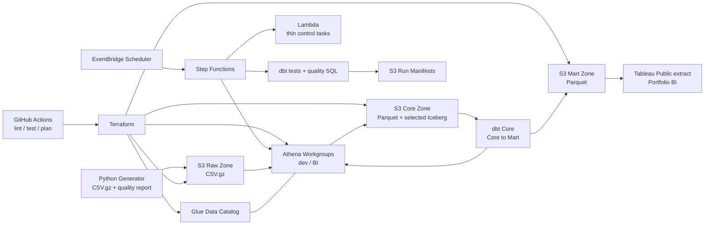
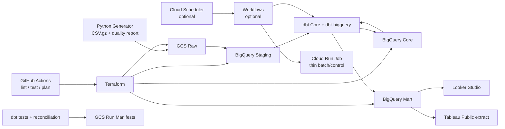

# AWS Free Plan前提の市場適合性・アーキテクチャレビュー（提案）

## 1. 本書の位置づけ

本書は、`docs/aws_freeplan_arch_direction.md`を基本方針として、案件受託用ポートフォリオの市場訴求力、実装負荷、AWS Free Planの制約、費用超過リスクをレビューした提案である。最終構成を確定するものではない。

前提：

- AWS Free Planは無料・最長6か月・最大200 USDクレジット
- ポートフォリオの主な提示期間は2～3か月
- Free PlanではRedshift等のリソース集約型サービスが制限される可能性が高い
- データ規模は約135万events、Core全体のParquet/Snappy見込みは約0.2～0.65GB
- GCP版とAWS版で論理列、粒度、KPI、品質テストを一致させる

本環境ではネットワーク制限により、2026-07-24時点の公式料金・Free Plan対象サービスを再取得していない。Free Planに関する事実はClaude Code側の検証済みドラフトを前提とし、変動し得る料金、無料枠、サービス制限は「要確認」と明記する。

---

## 2. エグゼクティブサマリー

### 推奨結論

AWS本編の中核は、引き続き次の構成を推奨する。

> S3 + Glue Data Catalog + Athena + dbt Core + Terraform + Step Functions/EventBridge + Lambda + GitHub Actions

これに以下を追加する案が、費用対効果と市場訴求のバランスがよい。

1. **データ品質をコード化**：dbt tests＋既存Python品質テスト
2. **IaC**：AWS/GCP両方をTerraform管理
3. **CI/CD**：GitHub Actionsで静的検証、unit test、dbt parse/test、Terraform plan
4. **コストガード**：Athena Workgroup、S3 lifecycle、Budgets、タグ
5. **Apache Icebergを限定採用**：更新・返金訂正が発生する代表テーブルだけ
6. **サーバーレスオーケストレーション**：低頻度のデモ実行

### Athenaに関するレビュー

「Athenaはコスト都合だけの妥協ではない」という見立ては、概ね妥当と考える。ただし表現を次のように精密化することを提案する。

- **S3 + Glue + Athenaだけ**：サーバーレスのデータレイク／query-on-lake
- **S3 + Glue + Athena + Iceberg**：ACID、schema evolution、snapshot/time travel等を伴うレイクハウス

したがって、現行構成だけを「モダンレイクハウス」と断定するより、まず「サーバーレス分析基盤」と説明し、Icebergを実用理由付きで加えた場合に「レイクハウス構成」と説明する方が信頼性が高い。

### Redshiftに関するレビュー

RedshiftをFree Plan本編へ組み込む案は推奨しない。

- Free Planでアクセス自体が制限される可能性がある
- Paid Planへの移行はクレジット超過時に実課金され得る
- ポートフォリオの主要な評価点は、Redshiftのロゴ追加より、モデリング、品質、IaC、CI/CD、コスト設計の完成度にある
- 一度だけの投入・スクリーンショットでは、実務経験を強く裏付けにくい

Redshiftを実行する場合は、本編完成後の独立した任意ケーススタディとし、Paid Planへの移行と課金リスクをユーザーが明示承認した場合だけに限定する案を提案する。

---

## 3. Claude Code方向性のレビュー

| 原案 | 評価 | レビューコメント |
|---|---|---|
| Athenaを中核として維持 | 採用推奨 | サーバーレス、分離ストレージ、Parquet、partition pruningを説明でき、AWS案件への関連性がある |
| Athenaをレイクハウスと位置づける | 条件付き | Iceberg等のopen table formatなしでは「query-on-lake」と表現する方が正確 |
| Redshiftを常時構成にしない | 採用推奨 | Free Plan制限と費用リスクに合う |
| Redshiftを使い捨てケーススタディ化 | 優先度低 | 技術的には可能でもFree Planではアクセス不可の可能性。Paid Plan承認が前提 |
| Iceberg追加 | 限定採用推奨 | 全テーブルではなく、更新・訂正・履歴が必要な代表テーブルで価値を示す |
| Terraform追加 | 最優先 | 無料で再現性、クラウド設計、レビュー可能性を強く示せる |
| dbt追加 | 最優先 | Core→Mart、test、docs、lineageを一つの成果物として示せる |
| Step Functions/EventBridge/Lambda | 採用推奨 | 低頻度・小規模なら有力。Free Plan上限は実装直前に要確認 |
| Great Expectations追加 | 原則非推奨 | dbt testsと既存generator品質テストに重複し、成果物が分散する |
| GitHub Actions | 最優先 | 変更品質とデプロイ手順を可視化できる。利用枠はrepository公開設定等で要確認 |

---

## 4. 市場適合性の考え方

## 4.1 Athena単体の市場価値

Athenaの採用で示せる能力：

- S3上のcolumnar dataをSQLで分析する設計
- compute/storage分離
- Glue Catalogによるschema管理
- Parquet、compression、partition、small-file対策
- scan量に基づくコスト最適化
- serverless workloadの権限、監視、結果出力管理
- BigQueryとの同一論理モデル比較

これらは、AWSのデータレイク、ログ分析、低頻度BI、ad hoc分析、ELT案件に直接つながる。Redshift経験と同一ではないが、「DWHを避けた廉価版」だけに限定される技術でもない。

### 説明上の注意

AthenaをRedshiftの完全代替とは説明しない方がよい。

| 観点 | Athena | Redshift |
|---|---|---|
| 主用途 | S3上のad hoc／serverless SQL、データレイク分析 | 高頻度BI、warehouse workload、concurrency、低遅延分析 |
| 課金 | 主にscan量 | provisioned/serverless computeとstorage等 |
| 物理設計 | file format、partition、table format | distribution、sort、workload、capacity等 |
| 更新 | Hive tableは限定的、Icebergで拡張 | warehouse DML |
| 向く規模・頻度 | 低～中頻度、変動workload | 定常的な分析と同時実行 |

ポートフォリオでは「要件とコスト特性からAthenaを選定し、定常高頻度BIならRedshiftも比較候補」と説明すると、製品選定能力を示しやすい。

## 4.2 2026年の市場訴求として強い要素

個別求人の件数・比率は最新の求人票調査が必要であり、本書では断定しない。ただし、データエンジニア／アナリティクスエンジニア案件で横断的に説明しやすい能力は次のとおり。

- SQLモデリングとsemantic/KPI contract
- dbtによる変換、test、documentation、lineage
- Terraformによる再現可能なcloud resource管理
- serverless／lakehouse設計
- open table format（Iceberg）
- orchestration、idempotency、retry、observability
- data quality、data contract
- CI/CD、OIDC、secretless deployment
- cost-aware architecture
- BI利用者の意思決定までつながるMart設計

市場性を高めるには、サービス数を増やすより、次の実行証跡を示す方が有効と考える。

- architecture decision record
- Terraform planと構成図
- dbt DAG／docs
- test結果
- pipeline実行履歴
- Athena scanned bytes
- 障害・再実行シナリオ
- 同一KPIのGCP/AWS照合結果

---

## 5. 追加要素の優先度評価

## 5.1 P0：本編へ追加を推奨

### A. Terraform

**採用提案：AWS/GCPの両方で必須に近い位置づけ**

示せる能力：

- S3/GCS、IAM、Glue、Athena、BigQuery、Lambda/Cloud Run等の再現可能な構築
- environment分離
- least privilege
- cost guardrailのコード化
- cloud間の設計差

費用：

- Terraform CLI自体は無料
- 作成するcloud resourceの料金は別
- HCP Terraform等は必須にしない

実装範囲案：

- provider/version pin
- remote stateは初期段階ではlocalでもよい
- AWS stateをS3＋DynamoDB lockで管理する案は、現在のTerraform/S3 lock方式と料金を要確認
- `fmt`、`validate`、`plan`をCI
- `apply`は手動承認
- destroy可能なresourceへproject tagとexpiration tag

過剰実装を避けるため、multi-account landing zone、Organizations、Control Towerは対象外とする。

### B. dbt Core

**採用提案：Core→Mart変換の正本**

成果：

- staging/core/intermediate/martの依存関係
- schema tests、singular tests、unit tests
- source freshness
- documentation
- exposuresとしてLooker Studio/Tableauを表現
- GCP/AWSで同一モデルを比較

AWSではAthena adapterの選定が必要になる。`dbt-athena-community`等の現行サポートversion、Iceberg materialization、Python 3.9/実行環境との互換性は導入時に要確認とする。dbt Labs公式adapterと同等のサポート主体と誤認しない。

GCPではBigQuery adapterを利用する。両cloudのSQL方言差はmacroへ隔離し、モデルを無理に100%共有しない。論理KPIとtestを共有し、物理materializationだけを分ける案を推奨する。

費用：

- dbt Core自体は無料
- dbt Cloud/Platformは必須にしない
- 実行先のAthena/BigQuery query料金は発生

### C. データ品質

**採用提案：二層構成**

1. 生成時：既存のPython `quality_report.md`
2. DWH変換時：dbt tests

dbt test候補：

- unique/not_null
- relationships
- accepted_values
- 金額式
- order header/item一致
- purchase event/order照合
- funnel単調性
- attribution credit合計
- RFM未来情報混入防止
- cohort未成熟NULL
- cloud間KPI差分

Great Expectations、Soda、Deequ等は有力な実在製品／OSSだが、今回の規模では検査定義が三重化する。外部データ品質製品の採用経験を特に訴求したい場合以外は追加しない案を推奨する。

### D. CI/CD

**採用提案：GitHub Actions**

Pull Request：

- Python compile/lint/unit test
- generator smoke
- schema contract vs DDL
- SQL lint
- dbt parse/compile/test（実cloud接続を要しない範囲を優先）
- Terraform fmt/validate
- security/static scan

main/manual workflow：

- OIDCでAWS/GCPへ短期認証
- Terraform plan artifact
- 承認後apply
- dbt build
- quality summary公開

無料枠：

- GitHub Actionsの無料利用条件はpublic/private repository、runner、月次minutesで異なるため要確認
- cloudへのOIDC federation自体と、呼び出すcloud API料金を分けて確認する

セキュリティ：

- 長期AWS access key／GCP service-account keyをrepository secretsへ置かない
- GitHub OIDCを優先
- pull request from forkにcloud権限を与えない
- production相当applyはenvironment approval

## 5.2 P1：限定的に追加を推奨

### A. Apache Iceberg

**採用提案：1～2テーブルで実務理由を示す**

Icebergを使う理由として適切なもの：

- 注文後の`cancelled`／`refunded`への状態更新
- late-arriving eventの補正
- schema evolution
- snapshot/time travelによる監査
- idempotent MERGE

代表テーブル案：

1. `fact_orders`：注文状態と`recognized_revenue`訂正
2. 必要なら`fact_events`：late-arriving eventの重複排除／追加

`fact_events`は基本的にappend-onlyなので、Icebergの価値を最も説明しやすいのは`fact_orders`と考える。単に全tableをIceberg化するより、dimensionやimmutable masterは通常Parquet、変更factはIcebergという選定理由を示す方がよい。

デモシナリオ案：

1. 初回注文を`completed`でload
2. 翌日、1～2%を`refunded`へ更新
3. Athena Engine Version 3の`MERGE INTO`等で訂正
4. 現snapshotの`recognized_revenue=0`を確認
5. time travelで訂正前を確認
6. dbt testでcurrent KPIと履歴を検証

無料枠／費用：

- Iceberg自体はopen format
- Athena query scan、S3 storage/request、Glue Catalog、metadata fileの費用は発生し得る
- `OPTIMIZE`、`VACUUM`、compactionはscan/writeを発生させる
- Athena Engine Version、対応DDL/DML、time travel syntax、Glue Catalog対応、Free Plan利用可否は実装時に要確認

小規模データでは技術的必要性が弱いため、「将来の更新・監査要件を再現したデモ」と説明する。

### B. Step Functions + EventBridge + Lambda

**採用提案：1日1回または手動の低頻度pipeline**

役割：

- EventBridge Scheduler：日次またはデモ時起動
- Step Functions：状態管理、retry、timeout、分岐
- Lambda：軽量なS3 manifest作成、Athena query起動、quality結果判定
- Athena：CTAS/MERGE/dbt生成SQL
- SNSは任意。通知先・無料枠・個人情報に注意

Lambda内で避ける処理：

- pandasで135万eventsを一括変換
- 長時間のdbt build
- Athena完了まで同期sleep
- 大きなParquet compaction

Step FunctionsではAthena service integration、wait/poll、エラー分岐を使い、Lambdaを薄く保つ案がよい。

状態例：

```text
Validate manifest
  -> Start Athena transformation
  -> Wait
  -> Check query
      -> failed: Record failure and stop
      -> succeeded: Run quality SQL
          -> failed: Quarantine
          -> passed: Publish run manifest
```

無料枠：

- Lambda request/compute
- Step Functions state transition
- EventBridge Scheduler invocation
- CloudWatch Logs

各無料枠とFree Plan対象は実装直前に要確認。低頻度でもログ保持を無期限にしない。

### C. Observability／run metadata

専用監視製品を増やさず、次を残す。

- `pipeline_run_id`
- source object checksum
- input/output row count
- started/completed timestamp
- Athena query execution ID
- scanned bytes
- dbt invocation ID
- test pass/fail
- error category

CloudWatch Dashboardは任意。ログ保持期間を7～14日程度にし、長期証跡は小さなJSON manifestとしてS3へ保存する案を提案する。CloudWatch料金とFree Plan対象は要確認。

## 5.3 P2：任意ケーススタディ

### Redshift

本編完成後、Redshift固有の設計比較を示す必要がある場合だけ検討する。詳細は第8章。

### Dataform

GCP固有のmanaged SQL transformationを示す価値はあるが、dbtと役割が重なる。AWS/GCP比較の主題を優先するならdbtへ統一し、Dataformは設計比較記事または小さなbranchに留める案を提案する。

## 5.4 非推奨

| 候補 | 理由 |
|---|---|
| MWAA / Cloud Composer | 小規模日次pipelineには高コスト・高運用負荷。Airflow自体を訴求する別目的がなければ過剰 |
| EMR常設cluster | データ量に対して過剰。起動・ネットワーク・課金管理が主成果を覆う |
| Glue ETL Job常用 | Sparkを必要としない規模。起動最低課金や実行料を要確認。Athena/dbt/Lambdaで足りる |
| Kinesis / MSK / Pub/Sub streaming | 生成データがbatchで、リアルタイム要件がない。架空要件のための追加になる |
| Great Expectations併用 | generator品質テスト＋dbt testsと重複 |
| dbt Cloud/Platform必須化 | 無料・再現可能なポートフォリオにはdbt Coreで十分。料金・期限依存を増やす |
| 全Core tableのIceberg化 | 更新不要tableまで複雑化し、metadata/maintenanceを増やす |
| Redshiftを本番相当で常設 | Free Plan制限、クレジット枯渇、停止漏れのリスク |
| NAT Gateway | 小規模serverless構成で高額化しやすい。private subnet要件を追加しない |

---

## 6. 推奨AWSアーキテクチャ

## 6.1 論理構成



## 6.2 Storage zone

| Zone | Format | Table format | Retention |
|---|---|---|---|
| Raw | CSV.gz | object | 入力証跡。2年分の固定生成物 |
| Staging | Parquet | Hive-compatible | 一時または短期expiration |
| Core immutable | Parquet/Snappy | Glue external table | dimension、append-only data |
| Core mutable | Parquet/Snappy | Iceberg | `fact_orders`等の限定table |
| Mart | Parquet/Snappy | external tableまたはIceberg不要 | BI向け集計 |
| Run metadata | JSON | object | checksum、row count、test結果 |

Raw/Staging/Core/Martをbucket分割するかprefix分割するかは、Terraform、IAM、lifecycleの分かりやすさで決める。この規模ではbucket乱立を避け、少数bucket＋明確なprefixでもよい。

## 6.3 Athena Workgroup

最低限：

- `dev`と`bi`を分離
- query result location固定
- result encryption
- per-query scan limit
- CloudWatch metrics
- Engine Version 3
- expected bucket owner
- result lifecycle

BIはMartだけを参照し、RawやCore eventsへの権限を与えない。Tableau Publicへ直接Athena connectionを公開するのではなく、匿名化済みextractを作成する方が安全である。

## 6.4 IAM

role案：

- `pipeline-role`：指定prefix、Glue table、Athena workgroupだけ
- `github-deploy-role`：Terraform plan/apply対象だけ。OIDC trustをrepository/branch/environmentで限定
- `bi-export-role`：Mart readとexport prefix writeだけ
- `developer-readonly-role`：metadata、logs、query historyのread

`AdministratorAccess`をCIへ付与しない。Free PlanでもIAM誤設定によるpublic dataや意図しないresource作成は防ぐ。

---

## 7. 推奨GCPアーキテクチャ

## 7.1 論理構成



## 7.2 強化提案

### dbtを主変換層にする

AWS/GCPで同一のDAG、test、docs、KPI contractを示せる。BigQuery固有のpartition/cluster設定はmodel configで分離する。

### Cloud Run Jobs

Cloud Functionsより、container化されたbatch、依存固定、ローカル再現性を示しやすい。ただしCloud Run Jobsの無料枠、CPU/memory、Artifact Registry、Cloud Buildの料金は実装直前に要確認。

生成データ全量をCloud Run上で毎回生成する必要はない。ローカル生成済みCSVのload制御、manifest検証等の薄い処理でも十分である。

### Workflows／Cloud Scheduler

AWS Step Functions/EventBridgeとの比較として分かりやすい。低頻度なら有力だが、無料枠と課金条件を要確認。1つのデモworkflowで十分とする。

### Dataform

Google Cloudネイティブのmanaged transformationとして実在するが、dbtと重複する。次のいずれかを選ぶ。

- **推奨**：dbtを両cloud共通の正本
- GCP特化を優先：Dataformを正本、AWSはdbt

ポートフォリオの比較可能性を優先する本案件では前者を提案する。Dataform自体の追加料金有無とBigQuery実行料金は要確認。

### Cloud Composer

非推奨。データ量と実行頻度に対して高コストであり、Workflows/Cloud Scheduler/Cloud Run Jobsで足りる。

### GCPでIcebergを無理に対称化しない

AWSでIceberg、GCPでBigQuery native tableという非対称は問題ではない。両cloudで同じサービスを並べるより、それぞれの代表的なmanaged/serverless設計を選び、KPI契約を一致させる方が設計能力を示せる。

---

## 8. Redshift使い捨てケーススタディの評価

## 8.1 採否

### Free Planのまま

**非推奨／実行不可の可能性**

Claude Code側の検証情報では、RedshiftおよびRedshift ServerlessはFree Planで制限され、`SubscriptionRequiredException`となる報告がある。したがって、Free Plan内で実行できる前提の計画へ含めない。

### Paid Planへ移行する場合

**本編完成後の任意実施**

実施価値：

- Athenaとwarehouseの比較decisionを示せる
- Redshift SQL、COPY、sort/distribution、workload観点を学習できる
- 同一Martの移植性を検証できる

限界：

- 数時間のcase studyは「Redshift実務経験」を意味しない
- BIやpipelineを常時接続しなければ運用経験の証明は限定的
- 課金事故リスクに対して追加訴求が小さい可能性

結論として、Redshiftロゴを追加する目的だけなら実施しない方がよい。Athena版完成後、「Athena vs Redshiftの要件比較記事」を成果物にしたい場合のみ検討する。

## 8.2 概算

原案の仮定：

- Redshift Serverless minimum/base capacity：8 RPU
- 概算：約3 USD/hour

この価格・minimum RPU・billing granularityはregionと最新仕様で**要確認**。

安全側の例：

| 作業 | 時間上限 | 概算compute |
|---|---:|---:|
| 作成・接続確認 | 0.5h | 約1.5 USD |
| COPY・model作成 | 1.0h | 約3 USD |
| query・EXPLAIN・比較 | 1.0h | 約3 USD |
| screenshot・結果export | 0.5h | 約1.5 USD |
| cleanup予備 | 0.5h | 約1.5 USD |
| 合計 | 3.5h | 約10.5 USD |

障害対応やidleを含め、**15～25 USDを1回の上限予算**として予約する案を提案する。storage、snapshot、S3 request、data transfer、CloudWatch等は別途発生し得る。

最大200 USDクレジットがあっても、全額を利用可能と仮定しない。

- 100 USD分はオンボーディング条件達成が必要
- credit対象外サービスがあり得る
- credit失効／適用順序がある
- Paid Planではcredit超過が実課金になり得る

## 8.3 実施前の必須確認

1. Free PlanではなくPaid Planが必要か
2. 既存credit残高と失効日
3. Redshift Serverlessがcredit対象か
4. region別RPU単価
5. minimum/base/max capacity
6. idle時の課金と自動停止挙動
7. namespace storage／backup／snapshot料金
8. data transfer
9. usage limitの強制action
10. AWS Budgetの通知遅延

1つでも公式資料で確認できなければ実行しない案を推奨する。

## 8.4 安全手順

### 実行前

- ユーザーの明示承認を取得
- 専用regionと名前prefixを決める
- Terraformで全resourceを列挙
- base/max RPUを最小設定
- usage limitをRPU-hoursで設定し、actionを可能な限り強制停止側にする
- 15 USD、20 USD、25 USD相当のBudgets alert
- CloudTrail/Cost Explorerで作成resourceを確認
- S3 inputを同regionへ置く
- SQL、期待結果、スクリーンショット項目を事前に準備
- 実作業timerを3.5時間上限で開始

Budget alertはリアルタイム停止装置ではない。通知だけに依存しない。

### 実行

1. Terraform apply
2. 接続確認
3. S3から小規模ParquetをCOPY／external schema等、ケーススタディ目的に必要な最小構成だけ投入
4. dbtまたはSQLで代表Martを2～3個作成
5. EXPLAIN、query時間、Athenaとの比較を記録
6. query history、容量、課金見込みを保存
7. 成果物をrepositoryのdocsへ保存

不要な常時BI接続、複数workgroup、concurrency scaling検証は避ける。

### 即時cleanup

「停止」で終わらせず、次を確認して削除する。

1. workgroup
2. namespace
3. snapshot／recovery point（保持が有料になるもの）
4. Redshift用IAM role
5. security group／subnet group
6. Secrets Manager secret
7. query result／一時S3 object
8. CloudWatch log group（必要な証跡export後）

最後に：

- AWS Resource Explorer／tag検索でprefix対象が0件
- Cost Explorerで翌日以降も確認
- credit残高確認
- Terraform stateと実resourceの差分確認

Redshift Serverlessのresource削除順、recovery point保持、usage limit actionは最新仕様で要確認。

## 8.5 Redshiftを実行しない代替成果物

無料のまま次を作る方が、費用対効果が高い可能性がある。

- AthenaとRedshiftのarchitecture decision record
- 同一Mart SQLのRedshift方言案
- distribution key／sort keyの設計案
- Athena scan costとRedshift break-evenの試算
- 高頻度BI／concurrencyが増えた場合のmigration条件

実環境を使っていないことは明記する。これでも製品選定の思考は示せる。

---

## 9. コスト評価

## 9.1 AWS本編

基準データ量では、Athena scanは小さい見込みである。`docs/schema_design_detail.md`の概算ではCore Parquet全体0.2～0.65GB、一般的な5 USD/TB仮定で0.5GB full scanは約0.0025 USDである。

ただし「Free Planだから完全無料」とは断定しない。次が課金対象になり得る。

- S3 storage/request
- Athena scan
- Glue Data Catalog
- Lambda compute/request
- Step Functions transition
- EventBridge invocation
- CloudWatch Logs/Metrics
- KMS request
- AWS Budgets/Cost Explorerの一部機能
- data transfer

基準ケースでは少額に収まる可能性が高いが、各サービスのFree Plan対象と月次上限は実装直前に要確認。

## 9.2 コストガードレール案

| 指標 | 警告 | 実行停止・相談 |
|---|---:|---:|
| Athena月次scan | 50GB | 100GB |
| Athena 1 query scan | 250MB | 500MB |
| S3総量 | 5GB | 8GB |
| Step Functions月次transition | 無料枠の50% | 無料枠の80% |
| Lambda月次usage | 無料枠の50% | 無料枠の80% |
| AWS credit消費 | 10 USD | 20 USD |
| Redshift | 事前承認必須 | 15～25 USD hard budget案 |

無料枠の割合を使う項目は、最新のFree Plan上限確認後に具体値へ置換する。

### 強制策

- Athena workgroup bytes-scanned cutoff
- lifecycle rule
- log retention
- Terraform resource allowlist
- CIで高額service resourceを検出
- region固定
- NAT Gateway禁止
- Redshift/EMR/MWAA resourceがplanに出たらfail

---

## 10. 実装フェーズ案

### Phase A：土台

1. Terraform
2. S3/GCS zone
3. Glue/Athena、BigQuery
4. IAM/OIDC
5. Cost/Budget guard

### Phase B：変換・品質

1. dbt Core project
2. staging/core/mart
3. dbt tests
4. documentation/exposures
5. GCP/AWS reconciliation

### Phase C：CI/CD

1. PR checks
2. Terraform plan
3. generator smoke
4. dbt build/test
5. artifacts

### Phase D：serverless orchestration

1. 手動Step Functions
2. retry/failure path
3. EventBridge低頻度schedule
4. run manifest
5. GCP Workflowsとの比較

### Phase E：Iceberg

1. `fact_orders`の初回snapshot
2. refund correction
3. MERGE
4. time travel
5. compaction/metadata cost記録

### Phase F：任意Redshift

本編完成、Free Plan/Paid Plan判断、料金再確認、ユーザー承認後のみ。

---

## 11. ポートフォリオでの見せ方

### 推奨メッセージ

> 同一ECデータモデルをBigQuery warehouseとS3/Athena lakehouseで実装し、dbtによる共通KPI、Terraform、品質テスト、CI/CD、コストガードを比較した。

AWSでIcebergを採用しない場合は「lakehouse」ではなく「serverless data lake analytics」とする。

### 掲載成果物

- GCP/AWS構成図
- service selection ADR
- dbt lineage
- schema contract
- quality report
- Terraform module構成
- CI結果
- Iceberg refund/time-travel demo
- cost dashboard／scan bytes
- BI dashboard
- failure/retry demo

### 誇張を避ける表現

- 「Redshift経験」ではなく「Redshift比較検証」
- 「リアルタイム基盤」ではなく「日次batch」
- 「大規模」ではなく「百万event規模の再現可能sample」
- 「AthenaがRedshiftより優れる」ではなく「workloadとコストに基づき選定」
- 「マルチクラウド移植可能」ではなく「論理contractを共通化し、物理最適化を分離」

---

## 12. 要判断事項

Claude Code＋ユーザー側で、実装開始前に次を決めることを提案する。

1. **AWS本編名称**
   - Icebergあり：serverless lakehouse
   - Icebergなし：serverless data lake analytics
2. **Iceberg採用範囲**
   - 推奨：`fact_orders`のみ
   - 拡張：`fact_orders`＋`fact_events`
   - 非採用
3. **変換基盤**
   - 推奨：両cloudともdbt Core
   - GCPはDataform、AWSはdbt
4. **オーケストレーション**
   - 推奨：AWS Step Functions、GCP Workflowsを1本ずつ
   - CI/manualのみ
5. **GitHub repository公開形態**
   - Actions無料枠、秘密情報、Public成果物との関係
6. **Cloud Run Jobsの採否**
   - Functionsを維持するか、batchをJobsへ寄せるか
7. **Redshift**
   - 推奨：実行しない
   - 任意：本編後、Paid Planと15～25 USD上限を明示承認して実施
8. **Free Plan再確認日**
   - Terraform apply直前に公式料金・制限を再確認し、結果をdecision logへ記録

---

## 13. 最終提案

最も費用対効果が高い構成は、Redshiftを追加することではなく、Athena構成を「実務で評価できる完成形」へ引き上げることだと考える。

優先順位：

1. Terraform
2. dbt Core
3. dbt tests＋cloud間reconciliation
4. GitHub Actions＋OIDC
5. Athena cost guard
6. Step Functions/EventBridge/Lambda
7. `fact_orders`限定Iceberg
8. Redshiftは任意

この順序なら、無料枠への依存を抑えながら、データエンジニア、アナリティクスエンジニア、BIエンジニアの各案件で説明できる成果物を増やせる。サービス数ではなく、設計理由、再現性、品質、運用、コストを一つのstoryとして提示する案を推奨する。
